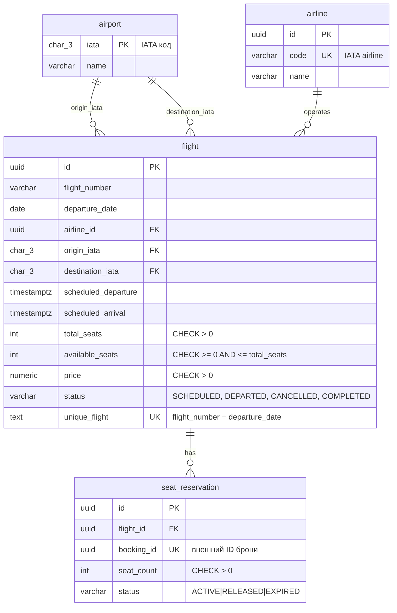
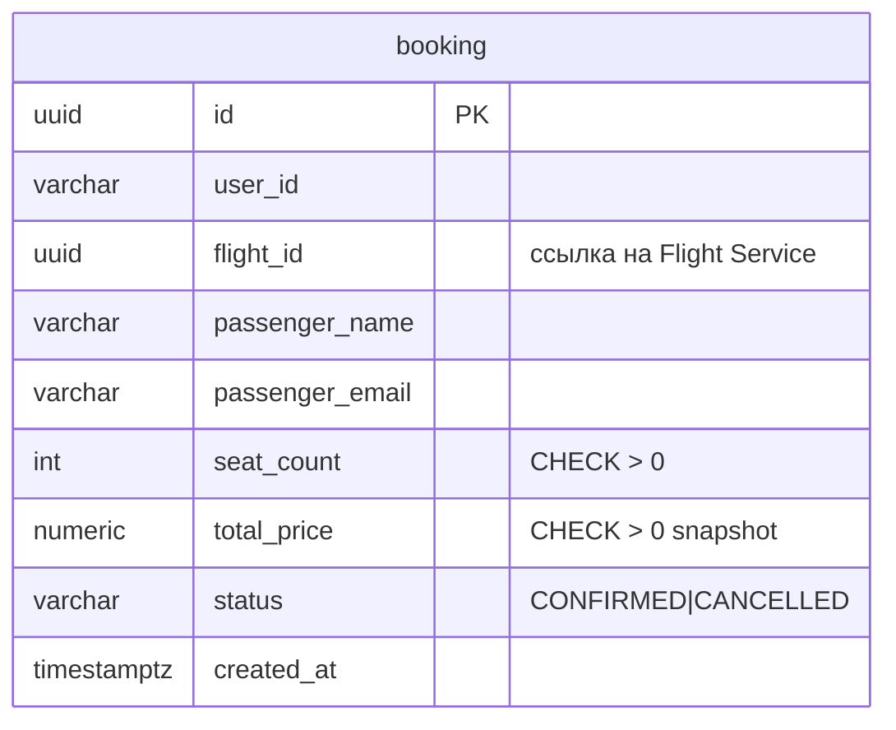

# ER-диаграмма (3NF)

Схемы разделены по сервисам

## Flight Service (PostgreSQL)

Ограничения целостности: `available_seats` неотрицательно; `total_seats`, `seat_count`, `price` > 0; уникальность пары `(flight_number, departure_date)`; одна активная резервация на `booking_id`

## Booking Service (PostgreSQL)

