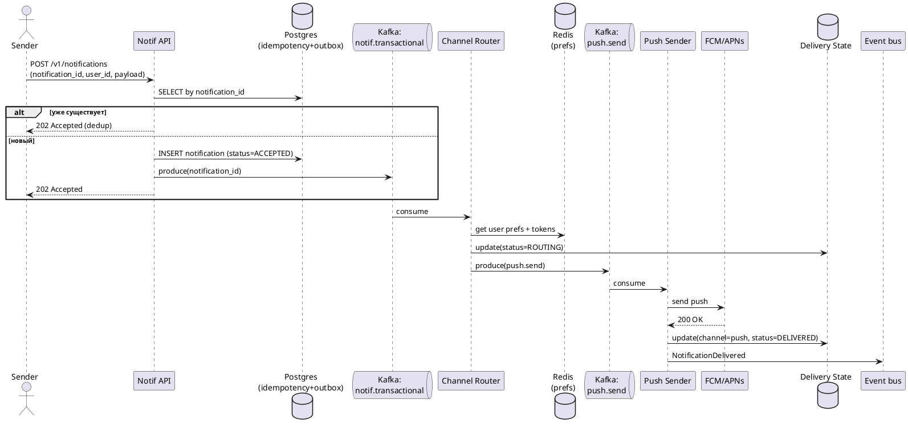
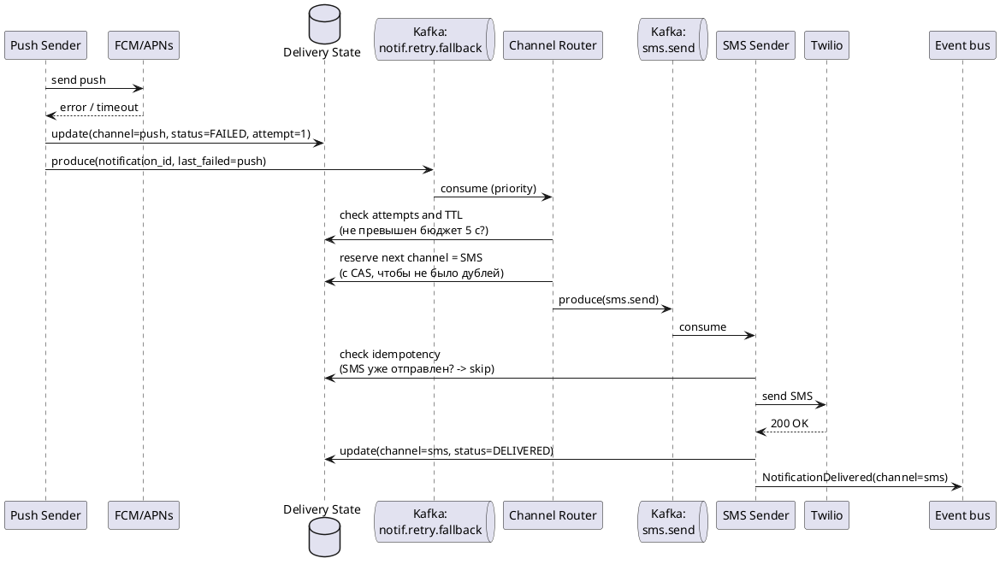
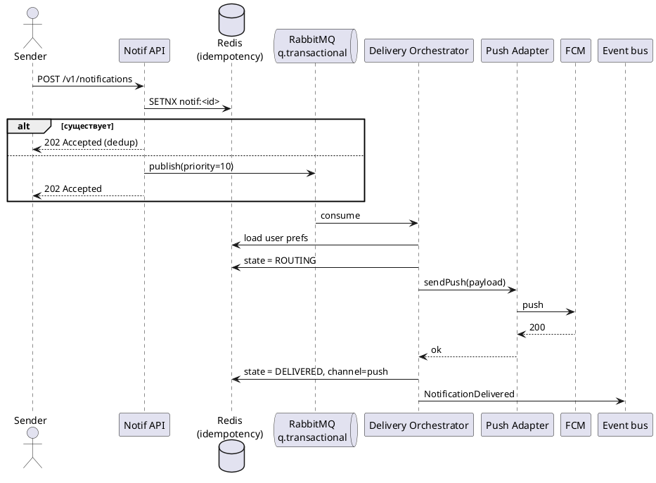
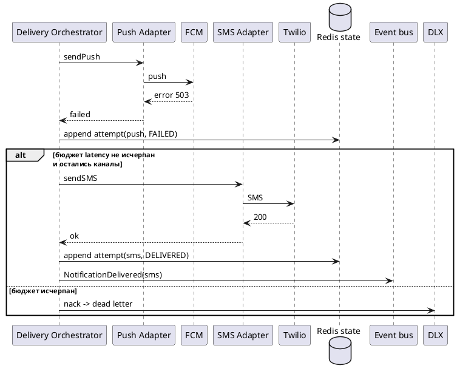

# RFC: Гарантированная доставка критичных уведомлений с кросс-канальным failover

| Метаданные | Значение |
|------------|----------|
| **Статус** | DRAFT |
| **Автор(ы)** | Царапкин Максим |
| **Ответственный** | [Имя Фамилия] |
| **Бизнес-заказчик** | [Имя Фамилия] |
| **Ревьюеры** | [Имя Фамилия] |
| **Дата создания** | 2026-04-07 |
| **Дата обновления** | 2026-04-07 |

---

## Оглавление

1. [Контекст](#контекст)
2. [Пользовательские сценарии](#пользовательские-сценарии)
3. [Статистика и расчёт нагрузки](#статистика-и-расчёт-нагрузки)
4. [Требования](#требования)
5. [Варианты решения](#варианты-решения)
6. [Сравнительный анализ](#сравнительный-анализ)
7. [Выводы](#выводы)
8. [Приложения](#приложения)

---

## Контекст

В онлайн-банке существует множество сценариев, в которых пользователю необходимо отправить транзакционное (критичное) уведомление: подтверждение перевода, списание средств, вход в личный кабинет с нового устройства, окончание срока действия карты и т.п. Сейчас каждая продуктовая команда отправляет такие уведомления самостоятельно. Это приводит к:

- задержкам и дублированию уведомлений;
- отсутствию централизованного контроля и observability;
- невозможности гарантировать доставку критичного сообщения, если основной канал (push) не сработал.

Платформа уведомлений (Notification Platform, NP) уже описана требованиями верхнего уровня (см. задания 1-7). Данный RFC углубляется в один из самых сложных её аспектов - **подсистему гарантированной доставки критичных уведомлений с автоматическим failover между каналами** (push -> SMS -> email).

### Какую проблему мы решаем

Спроектировать подсистему, которая:

1. гарантирует доставку критичного уведомления хотя бы через один канал;
2. автоматически переключается на резервный канал при отказе основного;
3. учитывает пользовательские настройки (предпочтительный канал; транзакционные уведомления нельзя отключить - это требование безопасности и регулятора);
4. минимизирует стоимость (SMS на ~2 порядка дороже push);
5. обеспечивает observability;
6. предотвращает дублирование при failover.

### Почему это важно сейчас

- Бизнес-цель: снизить количество жалоб на уведомления на 30% и поднять retention на 15%.
- Регуляторные требования: подтверждение операции должно быть доставлено в разумное время.
- Существующее "зоопарк-решение" уже даёт инциденты, связанные с потерянными уведомлениями.

---

## Пользовательские сценарии

| Приоритет | Тип | Действующее лицо | Сценарий |
|-----------|-----|------------------|----------|
| MUST HAVE | Транзакционный | Клиент банка | После подтверждения перевода клиент в течение <= 2 секунд получает уведомление о списании. Если push недоступен - приходит SMS. |
| MUST HAVE | Транзакционный | Клиент банка | При входе с нового устройства клиент гарантированно получает уведомление хотя бы по одному каналу. |
| MUST HAVE | Системный | Sender service | Внутренний сервис вызывает `POST /v1/notifications` с `notification_id` и получает `202 Accepted`; сервис не должен сам решать, через какой канал слать. |
| MUST HAVE | Защита от дублей | Клиент банка | Клиент НЕ получает дубликат уведомления, даже если sender повторно отправил запрос или сработал failover между каналами. |
| SHOULD HAVE | Настройки | Клиент банка | Клиент в личном кабинете указывает предпочтительный канал. Отключить транзакционные уведомления нельзя - кнопка disabled с пояснением. |
| SHOULD HAVE | Observability | SRE / Operations | Дежурный видит в реальном времени success rate доставки по каналам и получает алёрт при падении success rate ниже 99% за 5 минут. |
| COULD HAVE | Транзакционный | Клиент банка | При недоставке всеми каналами клиент видит уведомление в in-app inbox при следующем входе. |

---

## Статистика и расчёт нагрузки

### Исходные данные (из задания)

- MAU: 10 млн
- DAU: 3 млн
- Peak Concurrent Users: 300 000
- Среднее количество уведомлений на пользователя в день: транзакционных - 2, сервисных - 3, маркетинговых - 5.

### Расчёт

**Транзакционные уведомления (целевые для этого RFC):**

```
Объём в сутки     = 3 000 000 DAU x 2 = 6 000 000 / день
Средний RPS       = 6 000 000 / 86 400 ~ 70 RPS
```

Однако нагрузка распределена крайне неравномерно: основная масса транзакций - с 9:00 до 22:00 (~ 13 часов), а внутри этого окна есть пики (обед, вечер).

```
Дневной RPS (усреднённо за 13 ч)  = 6 000 000 / (13 x 3 600) ~ 130 RPS
Пиковый коэффициент (x5)          ~ 650 RPS
Пиковый коэффициент с запасом x10 ~ 1 300 RPS
```

**Все типы уведомлений (для понимания общей нагрузки на брокер):**

```
Объём в сутки = 3 000 000 x 10 = 30 000 000 / день
Средний RPS   ~ 350 RPS
Пиковый RPS   ~ 3 500 RPS
```

**Маркетинговые кампании (всплеск):**

```
1 000 000 уведомлений за окно 5 минут = 3 300 RPS только маркетинга
```

**Итоговая целевая ёмкость подсистемы:**

| Метрика | Значение |
|---|---|
| Sustained throughput (все типы) | ~5 000 уведомлений/с |
| Peak (с маркетингом) | ~20 000 уведомлений/с |
| Sustained transactional | ~1 500 уведомлений/с |
| Peak transactional | ~3 000 уведомлений/с |
| P95 latency transactional (приём -> провайдер) | <= 2 сек |
| P99 latency transactional | <= 5 сек |

**Хранилище состояния доставки:**

```
6 000 000 транзакционных в день x 30 дней хранения = 180 млн записей
Размер записи (id, user_id, статусы по 3 каналам, timestamps) ~ 500 байт
Объём:                ~ 90 ГБ (без индексов, с индексами x2 ~ 180 ГБ)
```

Это легко помещается в один хорошо настроенный Postgres-кластер либо в шардированный KV.

---

## Требования

### Функциональные требования (для подсистемы)

| № | Приоритет | Обозначение | Требование |
|---|-----------|-------------|------------|
| 1 | MUST | FR1 | Подсистема принимает запрос на отправку транзакционного уведомления через единый API с обязательным `notification_id` (UUID, генерируется отправителем) и возвращает `202 Accepted` после устойчивого сохранения. |
| 2 | MUST | FR2 | Подсистема выбирает порядок каналов на основании настроек пользователя, наличия push-токенов и cost-policy (по умолчанию: push -> SMS -> email). |
| 3 | MUST | FR3 | При неудаче/таймауте основного канала подсистема автоматически переключается на следующий канал в течение SLA. |
| 4 | MUST | FR4 | Подсистема гарантирует, что повторный приём запроса с тем же `notification_id` не приведёт к повторной отправке (идемпотентность с окном 24 часа). |
| 5 | MUST | FR5 | Подсистема публикует событие `NotificationDelivered` / `NotificationFailed` в общий event bus, доступный sender'ам и аналитике. |
| 6 | SHOULD | FR6 | Транзакционные уведомления нельзя отключить в настройках пользователя (UI и API ignore-flag для типа `transactional`). |
| 7 | SHOULD | FR7 | Подсистема поддерживает API для запроса текущего статуса доставки конкретного уведомления. |

### Нефункциональные требования

| № | Приоритет | Обозначение | Требование |
|---|-----------|-------------|------------|
| 1 | MUST | NFR1 | P95 latency "приём -> отправка провайдеру" для транзакционных <= 2 с, P99 <= 5 с. |
| 2 | MUST | NFR2 | Availability подсистемы >= 99,9% (~ 43 минуты простоя в месяц). |
| 3 | MUST | NFR3 | Durability принятого уведомления: вероятность потери <= 10^-6 при отказе одного компонента. |
| 4 | MUST | NFR4 | Throughput: устойчиво 5 000 RPS, пик 20 000 RPS. |
| 5 | MUST | NFR5 | Observability: 100% уведомлений имеют trace_id, метрики latency / success rate / cost per channel - в реальном времени. |
| 6 | MUST | NFR6 | Безопасность: PII (телефон, email) шифруются at rest (AES-256) и in transit (TLS 1.2+). |
| 7 | SHOULD | NFR7 | Cost: средняя стоимость доставки одного транзакционного уведомления <= 0.3 руб (push дешевле SMS на ~2 порядка - нужно по умолчанию ходить в push). |

### Архитектурно значимые требования (приоритизация)

| ASR | Приоритет | Источник |
|---|---|---|
| ASR1. Гарантированная доставка | P0 | NFR3, FR3, FR4 |
| ASR2. Latency <= 2 с (P95) для transactional | P0 | NFR1 |
| ASR3. Изоляция от маркетинговых кампаний | P0 | NFR4, ASR2 |
| ASR4. Минимизация стоимости | P1 | NFR7 |
| ASR5. Observability | P1 | NFR5 |

---

## Варианты решения

Рассматриваются два варианта. Оба используют принцип "принять -> durable store -> асинхронная доставка с failover", но различаются механизмом очередей и реализацией failover.

### Вариант 1: Kafka + Channel Router + Postgres State Store

> **Описание:** В качестве backbone используется Apache Kafka с разделением топиков по приоритетам. Состояние доставки - Postgres. Failover реализован через отдельный re-queue в топик следующего канала.

#### Архитектура (C4 - Container)

```
                                +----------------------------+
                                |       Sender services      |
                                | (payments, auth, cards...) |
                                +-------------+--------------+
                                              | HTTPS, mTLS
                                              v
                            +---------------------------------+
                            |   Notification API (stateless)  |
                            |   - валидация                   |
                            |   - идемпотентность по          |
                            |     notification_id (Redis+PG)  |
                            |   - запись в outbox (PG tx)     |
                            +---------+-----------------------+
                                      | produce
                                      v
                       +----------------------------------+
                       |            Apache Kafka          |
                       | topic: notif.transactional (P=24)|
                       | topic: notif.service       (P=12)|
                       | topic: notif.marketing     (P=48)|
                       | topic: notif.retry.<channel>     |
                       | topic: notif.dlq                 |
                       +----------+-----------------------+
                                  | consume
                                  v
                       +-------------------------------+
                       |       Channel Router          |
                       |  - читает user prefs (Redis)  |
                       |  - выбирает channel order     |
                       |  - публикует в push.send /    |
                       |    sms.send / email.send      |
                       +-----------+-------------------+
                                   |
              +--------------------+---------------------+
              v                    v                     v
     +----------------+   +----------------+   +-----------------+
     | Push Sender    |   | SMS Sender     |   | Email Sender    |
     | workers (FCM/  |   | workers        |   | workers         |
     | APNs)          |   | (Twilio,...)   |   | (SendGrid,...)  |
     +-------+--------+   +-------+--------+   +--------+--------+
             | status              | status              | status
             v                     v                     v
                +---------------------------------------+
                |   Delivery State Store (Postgres)     |
                |   notif_id, channel_attempts[],       |
                |   final_status, cost, timestamps      |
                +---------------+-----------------------+
                                | events
                                v
                       +------------------+
                       |  Event bus       |
                       |  (Kafka topic)   |
                       +------------------+

               Cross-cutting:
               - Redis: user prefs cache, idempotency keys
               - Device Registry (PG): push tokens
               - Observability: OpenTelemetry -> Prometheus + Loki + Tempo
```

#### Sequence diagram - основной сценарий (PlantUML)



#### Sequence diagram - failover



#### Как удовлетворены ASR

| ASR | Как |
|---|---|
| ASR1 | Kafka replication factor=3, acks=all; запись в Postgres outbox перед ack клиенту; retry-топик и DLQ. CAS-резервирование канала перед отправкой исключает гонки. |
| ASR2 | Отдельный топик `notif.transactional` с большим количеством партиций (P=24) и отдельным consumer group. In-memory кеш user prefs (Redis). Бюджет latency: API->Kafka <= 100 мс, Router <= 200 мс, Sender->провайдер <= 1 с -> P95 <= 2 с реалистично. |
| ASR3 | Физическое разделение топиков и consumer groups. Маркетинг едет в `notif.marketing` через отдельные воркеры с rate-limiter. |
| ASR4 | Channel Router по умолчанию выбирает push, переключается на SMS только при отказе. Cost-метрика per delivery. |
| ASR5 | OpenTelemetry trace_id прокидывается через Kafka headers; Prometheus метрики per channel; Tempo для distributed tracing. |

#### Конкретные технологии

- **Брокер:** Apache Kafka 3.x (3 брокера, RF=3, min.insync.replicas=2)
- **State store:** PostgreSQL 16 (1 primary + 2 replicas, partition by month)
- **Кеш:** Redis 7 (cluster mode, 3 шарда)
- **Сервисы:** Go / Kotlin (Spring Boot), stateless, в Kubernetes
- **Observability:** OpenTelemetry -> Prometheus + Grafana + Loki + Tempo

#### Преимущества
- Очень высокий throughput Kafka (легко держит 20k+ RPS).
- Repartitioning + consumer groups дают честное горизонтальное масштабирование.
- Replay из топика для расследования инцидентов.
- Чёткое разделение по приоритетам через топики.

#### Недостатки
- Kafka добавляет ~10-50 мс latency на produce+consume (терпимо в нашем бюджете).
- Сложнее "приоритетные сообщения внутри одного топика" - нужно проектировать через отдельные топики.
- Эксплуатация Kafka-кластера дорогая, требует команды или managed решения (Confluent / MSK).
- Failover-логика распределена между Channel Router и Sender'ами - нужно аккуратное тестирование.

---

### Вариант 2: RabbitMQ с приоритетными очередями + Redis State Store

> **Описание:** В качестве backbone - RabbitMQ с per-channel очередями и приоритетами. Состояние доставки - Redis (primary) + Postgres (для долгого хранения и аудита). Failover реализован централизованно в Delivery Orchestrator.

#### Архитектура (C4 - Container)

```
                                +----------------------------+
                                |       Sender services      |
                                +-------------+--------------+
                                              | HTTPS, mTLS
                                              v
                              +-----------------------------+
                              |   Notification API          |
                              |   - валидация               |
                              |   - идемпотентность (Redis) |
                              |   - запись в Redis+PG       |
                              +--------+--------------------+
                                       | publish
                                       v
                  +-----------------------------------------+
                  |             RabbitMQ                    |
                  |   exchange: notifications (direct)      |
                  |   queue: q.transactional (priority)     |
                  |   queue: q.service                      |
                  |   queue: q.marketing                    |
                  |   DLX: notifications.dlx                |
                  +--------+--------------------------------+
                           | consume
                           v
                +------------------------------------+
                |     Delivery Orchestrator          |
                |  - state machine per notification  |
                |  - в одном процессе пробует push,  |
                |    при ошибке -> SMS -> email      |
                |  - дедупликация в Redis            |
                +---------+--------------------------+
                          |  HTTP/gRPC
        +-----------------+------------------+
        v                 v                  v
  +------------+   +-------------+   +--------------+
  | Push       |   | SMS         |   | Email        |
  | adapter    |   | adapter     |   | adapter      |
  | (FCM/APNs) |   | (Twilio)    |   | (SendGrid)   |
  +------+-----+   +------+------+   +------+-------+
         |                |                 |
         v                v                 v
        +-------------------------------------+
        |  Delivery State                      |
        |  Redis (hot, TTL 24h)                |
        |  PostgreSQL (cold, 90 дней, audit)   |
        +-------------------------------------+
```

#### Sequence - основной сценарий (PlantUML)



#### Sequence - failover



#### Как удовлетворены ASR

| ASR | Как |
|---|---|
| ASR1 | RabbitMQ persistent messages + publisher confirms + mirror/quorum queues. Дедупликация в Redis с fallback в Postgres. DLX для нерешённых случаев. |
| ASR2 | Отдельная очередь `q.transactional` с приоритетом сообщений. Failover реализован в одном процессе orchestrator -> меньше сетевых хопов чем в варианте 1, что хорошо для latency. |
| ASR3 | Отдельные очереди и отдельные пулы воркеров для маркетинга, hard rate-limit. |
| ASR4 | Логика выбора каналов в Orchestrator (легче изменять), push first. |
| ASR5 | OpenTelemetry, метрики per channel, тот же Prometheus/Grafana. |

#### Конкретные технологии

- **Брокер:** RabbitMQ 3.12 (cluster, quorum queues)
- **State store:** Redis 7 (primary, hot) + PostgreSQL 16 (audit, cold storage)
- **Сервисы:** Go/Kotlin, stateless, Kubernetes
- **Observability:** тот же стек

#### Преимущества
- Низкая latency RabbitMQ (единицы мс на produce+consume).
- Приоритетные очереди "из коробки".
- Централизованный orchestrator: failover-логика в одном месте, проще тестировать.
- RabbitMQ проще в эксплуатации, чем Kafka, при наших объёмах (5k-20k RPS).

#### Недостатки
- Quorum queues RabbitMQ имеют ограничения по throughput (~30k msg/s на queue) - на пиках маркетинга 20k RPS впритык.
- Нет дешёвого replay - расследовать инциденты сложнее.
- Redis как primary state store - durability ниже Postgres; нужен careful AOF/replication.
- Centralized orchestrator - single point of complexity (хотя и горизонтально масштабируемый).

---

## Сравнительный анализ

### Ресурсные требования

| Критерий | Вариант 1 (Kafka) | Вариант 2 (RabbitMQ) |
|---|---|---|
| Сложность эксплуатации брокера | Высокая | Средняя |
| Throughput headroom | Очень высокий (x10 от пика) | Достаточный (x2 от пика) |
| Latency overhead на брокере | 10-50 мс | 1-10 мс |
| Стоимость инфраструктуры | Выше (Kafka cluster + ZK/KRaft) | Ниже |
| Команда | Нужна экспертиза по Kafka | Проще найти |
| Replay / расследование инцидентов | Отлично (нативный replay) | Слабо |
| Возможность роста x3 без рефакторинга | Да | Под вопросом для маркетинга |

### Соответствие требованиям

| Требование | Вариант 1 | Вариант 2 |
|---|---|---|
| FR1 (приём через API) | + | + |
| FR3 (auto failover) | + (через retry-топик) | + (внутри orchestrator) |
| FR4 (идемпотентность) | + (Redis+PG) | + (Redis+PG) |
| NFR1 (P95 <= 2 с) | + | + (с запасом) |
| NFR3 (durability <= 10^-6) | + (RF=3+PG) | ~ (зависит от настроек Redis/AOF) |
| NFR4 (20k RPS пик) | + | ~ (на грани) |
| NFR2 (99.9%) | + | + |

### Ключевые компромиссы

- **Kafka:** платим сложностью эксплуатации и небольшим overhead latency за неограниченную масштабируемость и отличные возможности расследования.
- **RabbitMQ:** платим ограничениями throughput и слабым replay за простоту и низкую latency.

---

## Выводы

> **Рекомендация:** Вариант 1 - Kafka + Channel Router + Postgres State Store.

**Обоснование выбора:**

1. **Запас по нагрузке.** Платформа NP - общая для всего банка, и через 1-2 года объёмы могут вырасти в 3-5 раз (новые продукты, выход на новые рынки). Kafka даёт запас roundly x10 от пика, RabbitMQ на quorum queues - x2. Мы не хотим переписывать backbone через год.
2. **Изоляция маркетинга от транзакций.** Физическое разделение топиков + отдельные consumer groups в Kafka - это самая надёжная гарантия, что кампания на 1 млн пользователей не "съест" транзакционный SLA. В RabbitMQ это тоже возможно через отдельные очереди, но при пиковых 20k RPS quorum queues становятся узким местом.
3. **Durability.** Запись в Postgres outbox до ack клиенту + Kafka с RF=3 даёт нам понятную и проверенную модель durability <= 10^-6. Redis-as-primary в варианте 2 - это компромисс по durability ради latency, который не оправдан, потому что бюджет 2 секунды и так выполняется с запасом.
4. **Observability и расследование инцидентов.** Возможность replay из Kafka - критическое преимущество для команды эксплуатации. Когда (а не если) случится инцидент с массовой потерей доставки, мы сможем восстановить картину.
5. **Latency.** Бюджет 2 секунды реалистично выполняется и в Kafka-варианте: API->Kafka <= 100 мс, Router <= 200 мс, Sender->провайдер <= 1 с, запас 700 мс на сетевые джиттеры.

**Принятые компромиссы:**

- **Сложность эксплуатации.** Берём managed Kafka (MSK / Confluent Cloud) на старте, чтобы не строить свою экспертизу с нуля.
- **Распределённая failover-логика.** Channel Router и Sender'ы должны быть тщательно покрыты интеграционными тестами. Делаем e2e-тест "убей провайдер X - увидь доставку через Y" обязательной частью CI.
- **Стоимость инфраструктуры выше.** Принимается как цена за надёжность критичного для банка контура.

**Ограничения решения:**

- Дедупликация работает в окне 24 часа. За пределами этого окна повторный запрос с тем же `notification_id` будет отправлен повторно. Это сознательный компромисс.
- Failover не работает, если у пользователя нет ни одного контактного канала (нет push-токена, нет телефона, нет email). Такие пользователи попадают в отдельную метрику "unreachable" и подсвечиваются продуктовой команде.
- Гарантируется доставка _до провайдера_, а не _до устройства пользователя_. Подтверждение от устройства (open event) - отдельный слой, не входит в этот RFC.

---

## Связанные задачи

- HW4, задания 1-7 - общие требования к Notification Platform (см. `hw4_tasks_1-7.md`).
- Будущий RFC: "User preferences service и Device Registry".
- Будущий RFC: "Маркетинговые кампании и Campaign Orchestrator".

---

## Приложения

### Глоссарий

| Термин | Определение |
|---|---|
| NP | Notification Platform - централизованная платформа уведомлений банка |
| ASR | Architecturally Significant Requirement |
| Failover | Автоматическое переключение на резервный канал/компонент при отказе основного |
| Idempotency key | Уникальный идентификатор операции, позволяющий безопасно её повторять |
| Outbox pattern | Шаблон, при котором сообщение сохраняется в БД в одной транзакции с бизнес-данными и публикуется отдельным процессом |
| DLQ / DLX | Dead Letter Queue / Exchange - хранилище сообщений, которые не удалось обработать |
| RF | Replication Factor - количество реплик в Kafka |
| MAU / DAU | Monthly / Daily Active Users |
